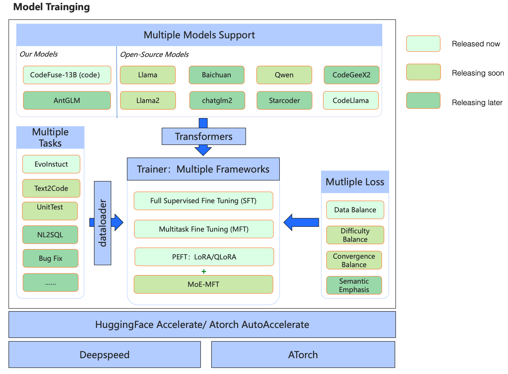

# MFTCoder: Multitask Fine-Tuneing framework for Code LLMs

<p align="center">
  
</p>


<div align="center">

<p>
    <a href="https://github.com/codefuse-ai/MFTCoder">
        
    </a>
    <a href="https://github.com/codefuse-ai/MFTCoder">
        
    </a>
    <a href="https://github.com/codefuse-ai/MFTCoder/LICENCE">
      
    </a>
    <a href="https://github.com/codefuse-ai/MFTCoder/issues">
      
    </a>
</p>


[[中文]](README_cn.md) [**English**]

</div>


## Contents
- [News](#News)
- [Articles](#Articles)
- [Introduction](#Introduction)
- [Requirements](#Requirements)
- [Training](#Training)
- [Models](#Models)
- [Datasets](#Datasets)
- [Star History](#Star-History)


## News
🔥🔥 [2023/11/07] [MFTCoder Paper](https://arxiv.org/abs/2311.02303) has been released on Arxiv, which introduces most technique details of multi-task-fine-tuning.

🔥🔥 [2023/10/20] [CodeFuse-QWen-14B](https://huggingface.co/codefuse-ai/CodeFuse-QWen-14B) has been released, achieving a pass@1 (greedy decoding) score of 48.8% on HumanEval, which gains 16% absolute improvement over the base model [Qwen-14b](https://huggingface.co/Qwen/Qwen-14B)

🔥🔥 [2023/09/27] [CodeFuse-StarCoder-15B](https://huggingface.co/codefuse-ai/CodeFuse-StarCoder-15B) has been released, achieving a pass@1 (greedy decoding) score of 54.9% on HumanEval.

🔥🔥🔥 [2023/09/26]We are pleased to announce the release of the [4-bit quantized version of CodeFuse-CodeLlama-34B](https://huggingface.co/codefuse-ai/CodeFuse-CodeLlama-34B-4bits). Despite the quantization process, the model still achieves a remarkable 73.8% accuracy (greedy decoding) on the HumanEval pass@1 metric.

🔥🔥🔥 [2023/09/07]We released **CodeFuse-CodeLlama-34B**, which achieves the **74.4% Python Pass@1** (greedy decoding) and surpasses GPT4 (2023/03/15) and ChatGPT-3.5 on the [HumanEval Benchmarks](https://github.com/openai/human-eval).

🔥🔥 [2023/08/26]We released MFTCoder which supports finetuning Code Llama, Llama, Llama2, StarCoder, ChatGLM2, CodeGeeX2, Qwen, and GPT-NeoX models with LoRA/QLoRA.

### HumanEval Performance
| Model                       | HumanEval(Pass@1) |  Date   | 
|:----------------------------|:-----------------:|:-------:|
| **CodeFuse-CodeLlama-34B**  |     **74.4%**      | 2023/09  |
|**CodeFuse-CodeLlama-34B-4bits** |     **73.8%**  |  2023/09 |
| WizardCoder-Python-34B-V1.0 |       73.2%       | 2023/08  |
| GPT-4(zero-shot)            |       67.0%       | 2023/03  |
| PanGu-Coder2 15B            |       61.6%       | 2023/08  |
| **CodeFuse-StarCoder-15B**  |     **54.9%**     | 2023/08  |
| CodeLlama-34b-Python        |       53.7%       | 2023/08  |
| **CodeFuse-QWen-14B**  |     **48.8%**     | 2023/10  |
| CodeLlama-34b               |       48.8%       | 2023/08  |
| GPT-3.5(zero-shot)          |       48.1%       | 2022/11 |
| OctoCoder                   |       46.2%       | 2023/08  |
| StarCoder-15B               |       33.6%       | 2023/05  |
| QWen-14B |     32.3%     | 2023/10  |


## Articles
[MFT Arxiv paper](https://arxiv.org/abs/2311.02303)

## Introduction

**High Accuracy and efficiency multi-task fine-tuning framework for Code LLMs.**

**CodeFuse-MFTCoder** is an open-source project of CodeFuse for multitasking Code-LLMs(large language model for code tasks), which includes models, datasets, training codebases and inference guides.
In MFTCoder, we released two codebases for finetuning Large Language Models: 
- ```mft_peft_hf``` is based on the HuggingFace Accelerate and deepspeed framework.
- ```mft_atorch``` is based on the [ATorch frameworks](https://github.com/intelligent-machine-learning/dlrover), which is a fast distributed training framework of LLM.

The aim of this project is to foster collaboration and share advancements in large language models, particularly within the domain of code development.

### Frameworks


### Highlights
:white_check_mark: **Multi-task**: Train models on multiple tasks while maintaining a balance between them. The models can even generalize to new, previously unseen tasks.

:white_check_mark: **Multi-model**: It integrates state-of-the-art open-source models such as gpt-neox, llama, llama-2, baichuan, Qwen, chatglm2, and more. (These finetuned models will be released in the near future.)

:white_check_mark: **Multi-framework**: It provides support for both HuggingFace Accelerate (with deepspeed) and [ATorch](https://github.com/intelligent-machine-learning/dlrover).

:white_check_mark: **Efficient fine-tuning**: It supports LoRA and QLoRA, enabling fine-tuning of large models with minimal resources. The training speed meets the demands of almost all fine-tuning scenarios.

The main components of this project include:
- Support for both SFT (Supervised FineTuning) and MFT (Multi-task FineTuning). The current MFTCoder achieves data balance among multiple tasks, and future releases will achieve a balance between task difficulty and convergence speed during training.
- Support for QLoRA instruction fine-tuning, as well as LoRA fine-tuning.
- Support for most mainstream open-source large models, particularly those relevant to Code-LLMs, such as Code-LLaMA, Starcoder, Codegeex2, Qwen, GPT-Neox, and more.
- Support for weight merging between the LoRA adaptor and base models, simplifying the inference process.
- Release of 2 high-quality code-related instruction fine-tuning datasets: [Evol-instruction-66k](https://huggingface.co/datasets/codefuse-ai/Evol-instruction-66k) and [CodeExercise-Python-27k](https://huggingface.co/datasets/codefuse-ai/CodeExercise-Python-27k).
- Release of 2 models: [CodeFuse-13B](https://huggingface.co/codefuse-ai/CodeFuse-13B) and [CodeFuse-CodeLlama-34B](https://huggingface.co/codefuse-ai/CodeFuse-CodeLlama-34B).


## Requirements
To begin, ensure that you have successfully installed CUDA (version >= 11.4, preferably 11.7) along with the necessary drivers. Additionally, make sure you have installed torch (version 2.0.1).

Next, we have provided an init_env.sh script to simplify the installation of required packages. Execute the following command to run the script:
```bash
sh init_env.sh
```
If you require flash attention, please refer to the following link for installation instructions: https://github.com/Dao-AILab/flash-attention


## Training
🚀 [Huggingface accelerate + deepspeed Codebase for MFT(Multi-task Finetuning)](./mft_peft_hf/README.md)

🚀 [Atorch Codebase for MFT(Multi-task Finetuning)](./mft_atorch/README.md)


## Models

We are excited to release the following two CodeLLMs trained by MFTCoder, now available on Hugging Face:


| Model                                                                                      | Base Model         | Num of examples trained | Batch Size | Seq Length | 
|--------------------------------------------------------------------------------------------|--------------------|-------------------------|------------|------------|
| [🔥🔥🔥 CodeFuse-CodeLlama-34B](https://huggingface.co/codefuse-ai/CodeFuse-CodeLlama-34B) | CodeLlama-34b-Python | 600k                    | 80         | 4096       | 
| [🔥🔥🔥 CodeFuse-CodeLlama-34B-4bits](https://huggingface.co/codefuse-ai/CodeFuse-CodeLlama-34B-4bits) |    CodeLlama-34b-Python|           |           | 4096       |
| [🔥🔥🔥 CodeFuse-StarCoder-15B](https://huggingface.co/codefuse-ai/CodeFuse-StarCoder-15B) | Starcoder | 600k                    | 256         | 4096       | 
| [🔥🔥🔥 CodeFuse-QWen-14B](https://huggingface.co/codefuse-ai/CodeFuse-QWen-14B) | Qwen-14b | 1100k                    | 256         | 4096       | 
| [🔥 CodeFuse-13B](https://huggingface.co/codefuse-ai/CodeFuse-13B)                         | CodeFuse-13B       | 66k                     | 64         | 4096       |


## Datasets
We are also pleased to release two code-related instruction datasets, meticulously selected from a range of datasets to facilitate multitask training. Moving forward, we are committed to releasing additional instruction datasets covering various code-related tasks.

| Dataset                                                                                 | Description      |
|-----------------------------------------------------------------------------------------|--------------------------------------------------------------------------------------------------------------------------------------------------------------|
| [⭐ Evol-instruction-66k](https://huggingface.co/datasets/codefuse-ai/Evol-instruction-66k)       | Based on open-evol-instruction-80k, filter out low-quality, repeated, and similar instructions to HumanEval, thus get high-quality code instruction dataset. |
| [⭐ CodeExercise-Python-27k](https://huggingface.co/datasets/codefuse-ai/CodeExercise-Python-27k) | python code exercise instruction dataset generated by chatgpt                                                                                                |
## Citation
If you use our codes or models, or feel our project useful for your R&D works, please cite our paper as below.
```
@article{mftcoder2023,
      title={MFTCoder: Boosting Code LLMs with Multitask Fine-Tuning}, 
      author={Bingchang Liu and Chaoyu Chen and Cong Liao and Zi Gong and Huan Wang and Zhichao Lei and Ming Liang and Dajun Chen and Min Shen and Hailian Zhou and Hang Yu and Jianguo Li},
      year={2023},
      journal={arXiv preprint arXiv},
      archivePrefix={arXiv},
       eprint={2311.02303}
}

## Star-History

<a href="https://star-history.com/#MFTCoder/MFTCoder&Date">
  <picture>
    <source media="(prefers-color-scheme: dark)" srcset="https://api.star-history.com/svg?repos=codefuse-ai/MFTCoder&type=Date&theme=dark" />
    
  </picture>
</a>

