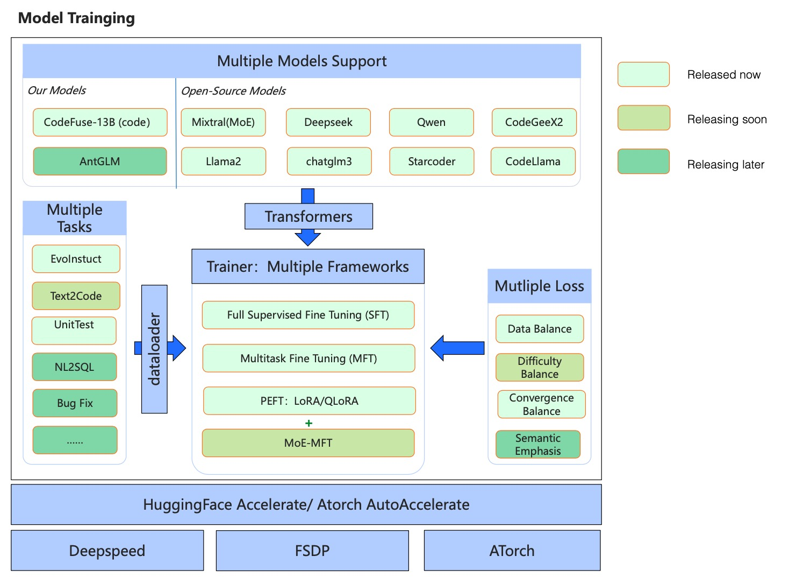

# MFTCoder: High Accuracy and Efficiency Multi-task Fine-Tuning Framework

<p align="center">
  
</p>


<div align="center">

<p>
    <a href="https://github.com/codefuse-ai/MFTCoder">
        
    </a>
    <a href="https://github.com/codefuse-ai/MFTCoder">
        
    </a>
    <a href="https://github.com/codefuse-ai/MFTCoder/LICENCE">
      
    </a>
    <a href="https://github.com/codefuse-ai/MFTCoder/issues">
      
    </a>
</p>
<p>
    🤗 <a href="https://huggingface.co/codefuse-ai" target="_blank">HuggingFace
    </a>• 🤖<a href="https://modelscope.cn/organization/codefuse-ai" target="_blank"> ModelScope
    </a>
</p>

[[中文]](README_cn.md) [**English**]

</div>


## Contents
- [News](#News)
- [Articles](#Articles)
- [Introduction](#Introduction)
- [Requirements](#Requirements)
- [Training](#Training)
- [Models](#Models)
- [Datasets](#Datasets)
- [Star History](#Star-History)
- [Join Us](#Join-Us)


## News
🔥🔥🔥 [2024/10/29] Our paper [CoBa: Convergence Balancer for Multitask Finetuning of Large Language Models](https://arxiv.org/abs/2410.06741) has been accepted by EMNLP-2024, which achieves balanced convergence across various tasks.

🔥🔥🔥 [2024/05/20] We released **MFTCoder v0.4**, mainly for MFTCoder-accelerate. It supports **QLoRA + DeepSpeed Zero3** and **QLoRA + FSDP** as options allowing you training very large models. It now supports new models like Qwen2, Qwen2-MoE, Starcoder2, Gemma, etc.

🔥🔥🔥 [2024/05/20] Our paper [MFTCoder: Boosting Code LLMs with Multitask Fine-Tuning](https://arxiv.org/abs/2311.02303) has been accepted by KDD2024.

🔥🔥🔥 [2024/05/20] [CodeFuse-StarCoder2-15B](https://huggingface.co/codefuse-ai/CodeFuse-StarCoder2-15B) has been released, achieving a pass@1 (greedy decoding) score of 73.2% on HumanEval.

🔥🔥 [2024/01/30] The model [CodeFuse-DeepSeek-33B](https://huggingface.co/codefuse-ai/CodeFuse-DeepSeek-33B) fine-tuned with MFTCoder ranks first in HuggingFace [Big Code Models LeaderBoard](https://huggingface.co/spaces/bigcode/bigcode-models-leaderboard)

🔥🔥 [2024/01/17] We released MFTCoder v0.3.0, mainly for MFTCoder-accelerate. It now supports new models like Mixtral(MoE), DeepSeek-coder, chatglm3. It supports FSDP as an option. It also supports Self-paced Loss as a solution for convergence balance in Multitask Fine-tuning.

🔥🔥 [2024/01/17] [CodeFuse-DeepSeek-33B](https://huggingface.co/codefuse-ai/CodeFuse-DeepSeek-33B) has been released, achieving a pass@1 (greedy decoding) score of 78.7% on HumanEval. It lists as top-1 LLM on Bigcode Leardboard in terms of win-rate, the official result is going to be published later.

🔥🔥 [2024/01/17] [CodeFuse-Mixtral-8x7B](https://huggingface.co/codefuse-ai/CodeFuse-Mixtral-8X7B) has been released, achieving a pass@1 (greedy decoding) score of 56.1% on HumanEval.

🔥🔥 [2023/11/07] [MFTCoder Paper](https://arxiv.org/abs/2311.02303) has been released on Arxiv, which discloses technique details of multi-task-fine-tuning.

🔥🔥 [2023/10/20] [CodeFuse-QWen-14B](https://huggingface.co/codefuse-ai/CodeFuse-QWen-14B) has been released, achieving a pass@1 (greedy decoding) score of 48.8% on HumanEval, which gains 16% absolute improvement over the base model [Qwen-14b](https://huggingface.co/Qwen/Qwen-14B)

🔥🔥 [2023/09/27] [CodeFuse-StarCoder-15B](https://huggingface.co/codefuse-ai/CodeFuse-StarCoder-15B) has been released, achieving a pass@1 (greedy decoding) score of 54.9% on HumanEval.

🔥🔥 [2023/09/26]We are pleased to announce the release of the [4-bit quantized version of CodeFuse-CodeLlama-34B](https://huggingface.co/codefuse-ai/CodeFuse-CodeLlama-34B-4bits). Despite the quantization process, the model still achieves a remarkable 73.8% accuracy (greedy decoding) on the HumanEval pass@1 metric.

🔥🔥 [2023/09/07]We released [**CodeFuse-CodeLlama-34B**](https://huggingface.co/codefuse-ai/CodeFuse-CodeLlama-34B-4bits), which achieves the **74.4% Python Pass@1** (greedy decoding) and surpasses GPT4 (2023/03/15) and ChatGPT-3.5 on the [HumanEval Benchmarks](https://github.com/openai/human-eval).

🔥🔥 [2023/08/26]We released MFTCoder-v0.1.0 which supports finetuning Code Llama, Llama, Llama2, StarCoder, ChatGLM2, CodeGeeX2, Qwen, and GPT-NeoX models with LoRA/QLoRA.

### HumanEval Performance
| Model                       | HumanEval(Pass@1) |  Date   | 
|:----------------------------|:-----------------:|:-------:|
| **CodeFuse-DeepSeek-33B**        |     **78.7%**     | 2024/01 |
| **CodeFuse-CodeLlama-34B**       |     **74.4%**     | 2023/09 |
| **CodeFuse-CodeLlama-34B-4bits** |     **73.8%**     | 2023/09 |
| **CodeFuse-StarCoder2-15B**      |     **73.2%**     | 2023/05 |
| WizardCoder-Python-34B-V1.0      |       73.2%       | 2023/08 |
| GPT-4(zero-shot)                 |       67.0%       | 2023/03 |
| PanGu-Coder2 15B                 |       61.6%       | 2023/08 |
| **CodeFuse-Mixtral-8x7B**        |     **56.1%**     | 2024/01 |
| **CodeFuse-StarCoder-15B**       |     **54.9%**     | 2023/08 |
| CodeLlama-34b-Python             |       53.7%       | 2023/08 |
| **CodeFuse-QWen-14B**            |     **48.8%**     | 2023/10 |
| CodeLlama-34b                    |       48.8%       | 2023/08 |
| GPT-3.5(zero-shot)               |       48.1%       | 2022/11 |
| OctoCoder                        |       46.2%       | 2023/08 |
| StarCoder-15B                    |       33.6%       | 2023/05 |
| QWen-14B                         |       32.3%       | 2023/10 |


## Articles
[MFTCoder: Boosting Code LLMs with Multitask Fine-Tuning (KDD2024)](https://arxiv.org/abs/2311.02303)

## Introduction

**High Accuracy and efficiency Multi-task Fine-tuning framework for Code LLMs.**

**MFTCoder** is an open-source project of CodeFuse for accurate and efficient Multi-task Fine-tuning(MFT) on Large Language Models(LLMs), especially on Code-LLMs(large language model for code tasks).
Moreover, we open source Code LLM models and code-related datasets along with the MFTCoder framework.

In MFTCoder, we released two codebases for finetuning Large Language Models: 
- **```MFTCoder-accelerate```** is a framework with accelerate and DeepSpeed/FSDP. All tech-stacks are open-source and vibrant. We highly recommend you try this framework and make your fintuning accurate and efficient.
- ```MFTCoder-atorch``` is based on the [ATorch frameworks](https://github.com/intelligent-machine-learning/dlrover), which is a fast distributed training framework of LLM.

The aim of this project is to foster collaboration and share advancements in large language models, particularly within the domain of code development.

### Frameworks


### Highlights
:white_check_mark: **Multi-task**: Train models on multiple tasks while maintaining a balance between them. The models can even generalize to new, previously unseen tasks.

:white_check_mark: **Multi-model**: It integrates state-of-the-art open-source models such as gpt-neox, llama, llama-2, baichuan, Qwen, chatglm2, and more. (These finetuned models will be released in the near future.)

:white_check_mark: **Multi-framework**: It provides support for both Accelerate (with Deepspeed and FSDP) and ATorch

:white_check_mark: **Efficient fine-tuning**: It supports LoRA, QLoRA as well as Full-parameters training, enabling fine-tuning of large models with minimal resources. The training speed meets the demands of almost all fine-tuning scenarios.

The main components of this project include:
- Support for both SFT (Supervised FineTuning) and MFT (Multi-task FineTuning). The current MFTCoder achieves data balance among multiple tasks, and future releases will achieve a balance between task difficulty and convergence speed during training.
- Support for QLoRA instruction fine-tuning, LoRA fine-tuning as well as Full-parameters fine-tuning.
- Support for most mainstream open-source large models, particularly those relevant to Code-LLMs, such as DeepSeek-coder, Mistral, Mixtral, Chatglm3, Code-LLaMA, Starcoder, Codegeex2, Qwen, GPT-Neox, and more.
- Support for weight merging between the LoRA adaptor and base models, simplifying the inference process.
- Release of 2 high-quality code-related instruction fine-tuning datasets: [Evol-instruction-66k](https://huggingface.co/datasets/codefuse-ai/Evol-instruction-66k) and [CodeExercise-Python-27k](https://huggingface.co/datasets/codefuse-ai/CodeExercise-Python-27k).
- Release of many Code LLMs, please refer to organizations: [codefuse-ai on huggingface](https://huggingface.co/codefuse-ai) or [codefuse-ai on modelscope](https://modelscope.cn/organization/codefuse-ai).


## Requirements
To begin, ensure that you have successfully installed CUDA (version >= 11.4, preferably 12.1) along with the necessary drivers. Additionally, make sure you have installed torch (version >= 2.1.0).

Next, we have provided an init_env.sh script to simplify the installation of required packages. Execute the following command to run the script:
```bash
sh init_env.sh
```
We highly recommend training with flash attention(version >= 2.3.0), please refer to the following link for installation instructions: https://github.com/Dao-AILab/flash-attention


## Training
As mentioned above, we open source two training frameworks. You could refer to their own READMEs for more details as followed. 

If you are familiar with open source ```transformers```, ```DeepSpeed``` or ```FSDP```, we highly recommend you try:

🚀🚀 [**MFTCoder-accelerate: Accelerate + Deepspeed/FSDP Codebase for MFT(Multi-task Finetuning)**](mftcoder_accelerate/README.md)


If you want to explore some new framework like atorch, you could check:

🚀 [MFTCoder-atorch: Atorch Codebase for MFT(Multi-task Finetuning)](mftcoder_atorch/README.md)


## Models

We are excited to release the following two CodeLLMs trained by MFTCoder, now available on both HuggingFace and ModelScope:


| Model                            | HuggingFace Links                                                         | ModelScope Links                                                                | Base Model           | Num of examples trained | Batch Size | Seq Length | 
|----------------------------------|---------------------------------------------------------------------------|---------------------------------------------------------------------------------|----------------------|-------------------------|------------|------------|
| 🔥  CodeFuse-DeepSeek-33B        | [h-link](https://huggingface.co/codefuse-ai/CodeFuse-DeepSeek-33B)        | [m-link](https://modelscope.cn/models/codefuse-ai/CodeFuse-DeepSeek-33B)        | DeepSeek-coder-33B   | 600K                    | 80         | 4096       |
| 🔥  CodeFuse-Mixtral-8x7B        | [h-link](https://huggingface.co/codefuse-ai/CodeFuse-Mixtral-8x7B)        | [m-link](https://modelscope.cn/models/codefuse-ai/CodeFuse-Mixtral-8x7B)        | Mixtral-8x7B         | 600K                    | 80         | 4096       |
| 🔥  CodeFuse-CodeLlama-34B       | [h-link](https://huggingface.co/codefuse-ai/CodeFuse-CodeLlama-34B)       | [m-link](https://modelscope.cn/models/codefuse-ai/CodeFuse-CodeLlama-34B)       | CodeLlama-34b-Python | 600K                    | 80         | 4096       |
| 🔥  CodeFuse-CodeLlama-34B-4bits | [h-link](https://huggingface.co/codefuse-ai/CodeFuse-CodeLlama-34B-4bits) | [m-link](https://modelscope.cn/models/codefuse-ai/CodeFuse-CodeLlama-34B-4bits) | CodeLlama-34b-Python |                         |            | 4096       |
| 🔥  CodeFuse-StarCoder-15B       | [h-link](https://huggingface.co/codefuse-ai/CodeFuse-StarCoder-15B)       | [m-link](https://modelscope.cn/models/codefuse-ai/CodeFuse-StarCoder-15B)       | StarCoder-15B        | 600K                    | 80         | 4096       |
| 🔥  CodeFuse-QWen-14B            | [h-link](https://huggingface.co/codefuse-ai/CodeFuse-QWen-14B)            | [m-link](https://modelscope.cn/models/codefuse-ai/CodeFuse-QWen-14B)            | Qwen-14b             | 1.1 Million             | 256        | 4096       | 
| 🔥  CodeFuse-CodeGeex2-6B        | [h-link](https://huggingface.co/codefuse-ai/CodeFuse-CodeGeex2-6B)        | [m-link](https://modelscope.cn/models/codefuse-ai/CodeFuse-CodeGeex2-6B)        | CodeGeex2-6B         | 1.1 Million             | 256        | 4096       | 
| 🔥  CodeFuse-StarCoder2-15B      | [h-link](https://huggingface.co/codefuse-ai/CodeFuse-StarCoder2-15B)        | [m-link](https://modelscope.cn/models/codefuse-ai/CodeFuse-StarCoder2-15B)        | Starcoder2-15B       | 700K                    | 128        | 4096       |

## Datasets
We are also pleased to release two code-related instruction datasets, meticulously selected from a range of datasets to facilitate multitask training. Moving forward, we are committed to releasing additional instruction datasets covering various code-related tasks.

| Dataset                                                                                 | Description      |
|-----------------------------------------------------------------------------------------|--------------------------------------------------------------------------------------------------------------------------------------------------------------|
| [⭐ Evol-instruction-66k](https://huggingface.co/datasets/codefuse-ai/Evol-instruction-66k)    | Based on open-evol-instruction-80k, filter out low-quality, repeated, and similar instructions to HumanEval, thus get high-quality code instruction dataset. |
| [⭐ CodeExercise-Python-27k](https://huggingface.co/datasets/codefuse-ai/CodeExercise-Python-27k) | python code exercise instruction dataset                                                                                                |


## Contributing
Contributions are welcome! If you have any suggestions, ideas, bug reports, or new model/feature supported, please open an issue or submit a pull request.

## Citation
If you find our work useful or helpful for your R&D works, please feel free to cite our paper as below.
```
@article{mftcoder2023,
      title={MFTCoder: Boosting Code LLMs with Multitask Fine-Tuning}, 
      author={Bingchang Liu and Chaoyu Chen and Cong Liao and Zi Gong and Huan Wang and Zhichao Lei and Ming Liang and Dajun Chen and Min Shen and Hailian Zhou and Hang Yu and Jianguo Li},
      year={2023},
      journal={arXiv preprint arXiv},
      archivePrefix={arXiv},
      eprint={2311.02303}
}
```

## Star-History

<a href="https://star-history.com/#MFTCoder/MFTCoder&Date">
  <picture>
    <source media="(prefers-color-scheme: dark)" srcset="https://api.star-history.com/svg?repos=codefuse-ai/MFTCoder&type=Date&theme=dark" />
    
  </picture>
</a>

## Join-US

We are the AI Native team within the Platform Technology Business Group at Ant Group, dedicated to the intelligentization of Ant Group's platform engineering. Established for over three years, our team has played a pivotal role in supporting the intelligent operation and maintenance of Ant Group's cloud computing infrastructure. Our mission is to build algorithm services and platforms with a wide user base through world-class technological innovation and impact, supporting the implementation of internal and external products and businesses.
Embracing an innovation-driven ethos, our team not only supports business implementation but also propels technological influence. Over the past three years, we have published more than 20 papers at top conferences like ICLR, NeurIPS, KDD, and ACL. Our innovative business outcomes have earned us two Ant Technology's highest T-Star awards and one SuperMA award from Ant Group. Our open-source project CodeFuse has received 4K stars as of February 2024, and our models have been downloaded over 1.5 million times on Huggingface and Modelscope.

**We are on the lookout for top talents to join our vibrant team! If you're eager to develop your career in an environment filled with energy, innovation, and a culture of excellence, we welcome you to explore our career opportunities for both campus and experienced hires. Join us and be a part of creating the next milestone in the industry.**

**Campus Recruitment**: https://hrrecommend.antgroup.com/guide.html?code=8uoP5mlus5DqQYbE_EnqcE2FD5JZH21MwvMUIb9mb6X3osXPuBraG54SyM8GLn_7

**Experienced Hires**: https://talent.antgroup.com/off-campus-position?positionId=1933830
