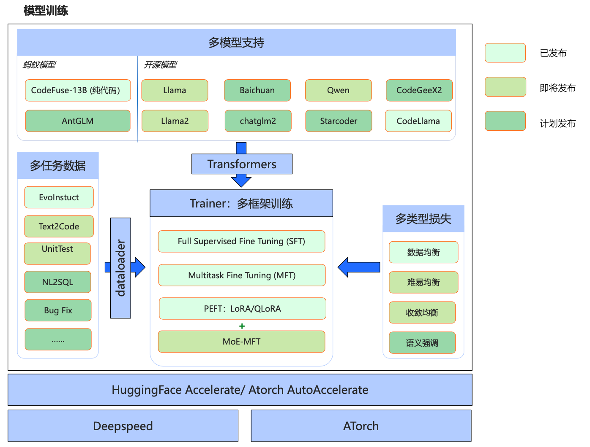

# CodeFuse-MFTCoder: 多任务微调代码大模型

<p align="center">
  
</p>


<div align="center">

<p>
    <a href="https://github.com/codefuse-ai/MFTCoder">
        
    </a>
    <a href="https://github.com/codefuse-ai/MFTCoder">
        
    </a>
    <a href="https://github.com/codefuse-ai/MFTCoder/LICENCE">
      
    </a>
    <a href="https://github.com/codefuse-ai/MFTCoder/issues">
      
    </a>
</p>

[**中文**] [[English]](README.md)

</div>


## 目录
- [新闻](#新闻)
- [文章](#文章)
- [项目简介](#项目简介)
- [环境](#环境)
- [训练](#训练)
- [模型](#模型)
- [数据集](#数据集)


## 新闻
🔥🔥🔥 [2023/09/26]CodeFuse-CodeLlama-34B 4bits量化版本发布，量化后模型在HumanEval pass@1指标为73.8% (贪婪解码)。

🔥🔥🔥 [2023/09/07]MFTCoder微调的模型**CodeFuse-CodeLlama-34B**在[HumanEval Benchmarks](https://github.com/openai/human-eval)的Python **Pass@1** 取得了**74.4%**（greedy decoding）的开源SOTA成绩。

🔥 [2023/08/26]MFTCoder支持使用LoRA/QLoRA对Code Llama、Llama、Llama2、StarCoder、ChatGLM2、CodeGeeX2、Qwen和GPT-NeoX模型进行微调。

### HumanEval表现
| 模型                          | HumanEval(Pass@1) |   日期    |
|:----------------------------|:-----------------:|:-------:|
| **CodeFuse-CodeLlama-34B**  |     **74.4%**      | 2023/09  |
|**CodeFuse-CodeLlama-34B-4bits** |     **73.8%**  | 2023/09 |
| WizardCoder-Python-34B-V1.0 |       73.2%       | 2023/08  |
| GPT-4(zero-shot)            |       67.0%       | 2023/03  |
| PanGu-Coder2 15B            |       61.6%       | 2023/08  |
| CodeLlama-34b-Python        |       53.7%       | 2023/08  |
| CodeLlama-34b               |       48.8%       | 2023/08  |
| GPT-3.5(zero-shot)          |       48.1%       | 2022/11 |
| OctoCoder                   |       46.2%       | 2023/08  |
| StarCoder-15B               |       33.6%       | 2023/05  |
| LLaMA 2 70B(zero-shot)      |       29.9%       | 2023/07  |

## 文章
敬请期待

## 项目简介
**Codefuse-MFTCoder** 是一个开源的多任务代码大语言模型项目，包含代码大模型的模型、数据、训练等。我们希望通过开源，分享交流大语言模型在代码领域的进步。

### 项目框架


### 项目优势
:white_check_mark: **多任务**：一个模型同时支持多个任务，会保证多个任务之间的平衡，甚至可以泛化到新的没有见过的任务上去；

:white_check_mark: **多模型**：支持最新的多个开源模型，包括gpt-neox，llama，llama-2，baichuan，Qwen，chatglm2等；

:white_check_mark: **多框架**：同时支持HuggingFace 和 [ATorch 框架](https://github.com/intelligent-machine-learning/dlrover)；

:white_check_mark: **高效微调**：支持LoRA和QLoRA，可以用很少的资源去微调很大的模型，且训练速度能满足几乎所有微调场景；


本项目主要内容如下：
- 同时支持单任务SFT(Supervised FineTuning)和MFT(Multi-task FineTuning), 当前开源支持数据均衡，未来将持续开源难易均衡， 收敛均衡等
- 支持QLoRA低成本高效指令微调、LoRA高效指令微调。
- 支持绝大部分主流的开源大模型，重点关注代码能力优秀的开源大模型，如Qwen, GPT-Neox, Starcoder, Codegeex2, Code-LLaMA等。
- 支持lora与base model进行权重合并，推理更便捷。
- 整理并开源2个指令微调数据集：[Evol-instruction-66k](https://huggingface.co/datasets/codefuse-ai/Evol-instruction-66k)和[CodeExercise-Python-27k](https://huggingface.co/datasets/codefuse-ai/CodeExercise-Python-27k)。
- 开源2个[Codefuse系列指令微调模型权重]：[CodeFuse-13B](https://huggingface.co/codefuse-ai/CodeFuse-13B)和[CodeFuse-CodeLlama-34B](https://huggingface.co/codefuse-ai/CodeFuse-CodeLlama-34B)。


## 环境
首先, 你需要将CUDA(>=11.4, 推荐11.7)及其相关驱动安装成功，并确保其工作正常, 并且安装基本的torch（>=2.0.0）
在requirements.txt下固定了几个主要的python包的版本，执行如下脚本即可：
```bash
sh init_env.sh
```
如果希望使用flash attention, 安装请参考 https://github.com/Dao-AILab/flash-attention

## 训练
🚀 [Huggingface accelerate + deepspeed Codebase for MFT(Multi-task Finetuning)](./mft_peft_hf/README.md)

🚀 [Atorch Codebase for MFT(Multi-task Finetuning)](./mft_atorch/README.md)


## 模型

使用本项目的训练代码，以及上述训练数据，我们训练并在huggingface开源了以下模型。

| 模型                                                            | 基座模型                 | 训练数据 | Batch Size | Seq Length |
|---------------------------------------------------------------|----------------------|------|------------|------------|
| [🔥🔥🔥  CodeFuse-CodeLlama-34B](https://huggingface.co/codefuse-ai/CodeFuse-CodeLlama-34B) | CodeLlama-34b-Python | 60万  | 80         | 4096       |
| [🔥🔥🔥  CodeFuse-CodeLlama-34B-4bits](https://huggingface.co/codefuse-ai/CodeFuse-CodeLlama-34B-4bits) | CodeLlama-34b-Python |   |          | 4096       |
| [🔥 CodeFuse-13B](https://huggingface.co/codefuse-ai/CodeFuse-13B)           | CodeFuse-13B-Base    | 6.6万 | 64         | 4096       |


## 数据集
目前本项目主要整理了如下指令数据集，并将其整理成统一的数据格式，这两个指令微调数据集是我们多任务训练中数十个任务中的2个，未来我们会陆续开源更多的代码任务指令微调数据集：

| 数据集                                                           | 介绍                                                                 |
|---------------------------------------------------------------|--------------------------------------------------------------------|
| [⭐ Evol-instruction-66k](https://huggingface.co/datasets/codefuse-ai/Evol-instruction-66k)    | 基于开源open-evol-instruction-80k过滤低质量，重复和human eval相似的数据后得到的高质量代码类微调数据 |
| [⭐ CodeExercise-Python-27k](https://huggingface.co/datasets/codefuse-ai/CodeExercise-Python-27k) | 基于chatgpt生成的高质量python练习题数据                                         |


