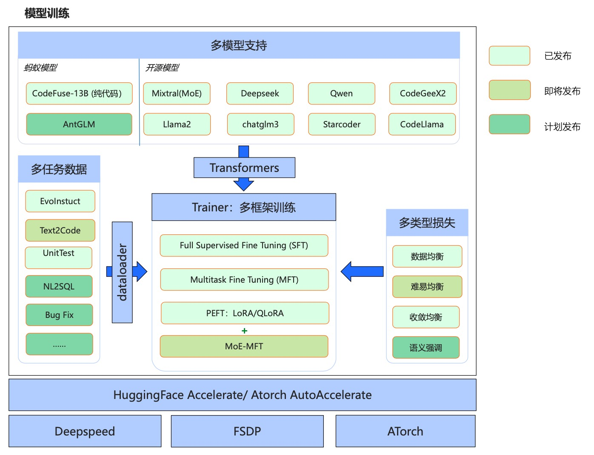

# MFTCoder: 高效准确的多任务大模型微调框架

<p align="center">
  
</p>


<div align="center">

<p>
    <a href="https://github.com/codefuse-ai/MFTCoder">
        
    </a>
    <a href="https://github.com/codefuse-ai/MFTCoder">
        
    </a>
    <a href="https://github.com/codefuse-ai/MFTCoder/LICENCE">
      
    </a>
    <a href="https://github.com/codefuse-ai/MFTCoder/issues">
      
    </a>
</p>

<p>
    🤗 <a href="https://huggingface.co/codefuse-ai" target="_blank">HuggingFace</a>
    • 🤖 <a href="https://modelscope.cn/organization/codefuse-ai" target="_blank">魔搭</a>
</p>

[**中文**] [[English]](README.md)

</div>


## 目录
- [新闻](#新闻)
- [文章](#文章)
- [项目简介](#项目简介)
- [环境](#环境)
- [训练](#训练)
- [模型](#模型)
- [数据集](#数据集)
- [加入我们](#加入我们)


## 新闻
🔥🔥🔥 [2024/10/31] **MFTCoder-v0.5**发布，新增**xxpo**模块支持偏好对齐DPO/RPO/ORPO；新增**mpt**和**offline_tokenization**模块支持全量参数的加训；在原本的**pefts**模块（MFT）更新selfpaced收敛均衡技术并更名CoBa。

🔥🔥🔥 [2024/10/31] 我们的论文 [CoBa: Convergence Balancer for Multitask Finetuning of Large Language Models](https://arxiv.org/abs/2410.06741) 已被 EMNLP 2024 接收，可以实现多任务收敛均衡。

🔥🔥🔥 [2024/05/20] **MFTCoder-v0.4**发布。新增支持**QLoRA+ DeepSpeed Zero3**, **QLoRA + FSDP**训练模式，可以更好的支持微调更大的模型，比如Qwen1.5-70B等。新增对Qwen2, Qwen2-MoE, Starcoder2, Gemma等模型的支持。

🔥🔥🔥 [2024/05/20] 我们的论文 [MFTCoder: Boosting Code LLMs with Multitask Fine-Tuning](https://arxiv.org/abs/2311.02303) 已被 KDD 2024 接收.

🔥🔥🔥 开源了[CodeFuse-StarCoder2-15B](https://huggingface.co/codefuse-ai/CodeFuse-StarCoder2-15B)模型，在HumanEval上可以达到73.2%，多代码语言能力均衡.

🔥🔥 [2024/01/17] **MFTCoder-v0.3.0**发布。新增对Mixtral(MoE), DeepSeek等模型的支持；新增支持FSDP(Fully Sharded Data Parallel)；新增Self-paced Loss, 支持多任务收敛均衡。 感兴趣详见微信公众号CodeFuse的文章[MFTCoder 重磅升级v0.3.0发布](https://mp.weixin.qq.com/s/xI3f0iUKq9TIIKZ_kMtcQg)

🔥🔥 [2024/01/17] 开源了[CodeFuse-DeepSeek-33B](https://huggingface.co/codefuse-ai/CodeFuse-DeepSeek-33B)模型，在HumanEval pass@1(greedy decoding)上可以达到78.7%。该模型在Big Code榜单的结果近期发布，请关注公众号获取最新信息。

🔥🔥 [2024/01/17] 开源了[CodeFuse-Mixtral-8x7B](https://huggingface.co/codefuse-ai/CodeFuse-Mixtral-8x7B)模型，在HumanEval pass@1(greedy decoding)上可以达到56.1%。感兴趣详见微信公众号CodeFuse的文章[MFTCoder提升Mixtral-8x7B混合专家模型的代码能力实践](https://mp.weixin.qq.com/s/xI3f0iUKq9TIIKZ_kMtcQg)

🔥🔥 [2023/11/07] [MFTCoder论文](https://arxiv.org/abs/2311.02303)在Arxiv公布，介绍了多任务微调的技术细节。

🔥🔥 [2023/10/20] 开源了[CodeFuse-QWen-14B](https://huggingface.co/codefuse-ai/CodeFuse-QWen-14B)模型，在HumanEval pass@1(greedy decoding)上可以达到48.8%。相比较与基座模型Qwen-14b提升16%。感兴趣详见微信公众号CodeFuse[文章](https://mp.weixin.qq.com/s/PCQPkvbvfxSPzsqjOILCDw)

🔥🔥 [2023/09/27] 开源了[CodeFuse-StarCoder-15B](https://huggingface.co/codefuse-ai/CodeFuse-StarCoder-15B)模型，在HumanEval pass@1(greedy decoding)上可以达到54.9%。

🔥🔥 [2023/09/26] [CodeFuse-CodeLlama-34B-4bits](https://huggingface.co/codefuse-ai/CodeFuse-CodeLlama-34B-4bits)量化版本发布，量化后模型在HumanEval pass@1指标为73.8% (贪婪解码)。

🔥🔥 [2023/09/07]MFTCoder微调的模型**CodeFuse-CodeLlama-34B**在[HumanEval Benchmarks](https://github.com/openai/human-eval)的Python **Pass@1** 取得了**74.4%**（greedy decoding）的开源SOTA成绩。

🔥🔥 [2023/08/26]MFTCoder-v0.1.0 支持使用LoRA/QLoRA对Code Llama、Llama、Llama2、StarCoder、ChatGLM2、CodeGeeX2、Qwen和GPT-NeoX模型进行微调。

### HumanEval表现
| 模型                               | HumanEval(Pass@1) |   日期    |
|:---------------------------------|:-----------------:|:-------:|
| **CodeFuse-DeepSeek-33B**        |     **78.7%**     | 2024/01 |
| **CodeFuse-CodeLlama-34B**       |     **74.4%**     | 2023/09 |
| **CodeFuse-CodeLlama-34B-4bits** |     **73.8%**     | 2023/09 |
| **CodeFuse-StarCoder2-15B**      |     **73.2%**     | 2023/05 |
| WizardCoder-Python-34B-V1.0      |       73.2%       | 2023/08 |
| GPT-4(zero-shot)                 |       67.0%       | 2023/03 |
| PanGu-Coder2 15B                 |       61.6%       | 2023/08 |
| **CodeFuse-Mixtral-8x7B**        |     **56.1%**     | 2024/01 |
| **CodeFuse-StarCoder-15B**       |     **54.9%**     | 2023/08 |
| CodeLlama-34b-Python             |       53.7%       | 2023/08 |
| **CodeFuse-QWen-14B**            |     **48.8%**     | 2023/10 |
| CodeLlama-34b                    |       48.8%       | 2023/08 |
| GPT-3.5(zero-shot)               |       48.1%       | 2022/11 |
| OctoCoder                        |       46.2%       | 2023/08 |
| StarCoder-15B                    |       33.6%       | 2023/05 |
| QWen-14B                         |       32.3%       | 2023/10 |


## 文章
🔥 [CodeFuse-MFTCoder提升CodeGeeX2-6B代码能力](https://mp.weixin.qq.com/s/kWMtHIoe3ytN8pRVi_CHZg)

🔥 [CodeFuse-MFTCoder提升Qwen-14B代码能力](https://mp.weixin.qq.com/s/PCQPkvbvfxSPzsqjOILCDw)


## 项目简介
**国际首个高精度、高效率、多任务、多模型支持、多训练算法，大模型代码能力微调框架；**

**Codefuse-MFTCoder** 是一个开源的多任务代码大语言模型项目，包含代码大模型的模型、数据、训练等。我们希望通过开源，分享交流大语言模型在代码领域的进步。

### 项目框架


### 项目优势
:white_check_mark: **多任务**：一个模型同时支持多个任务，会保证多个任务之间的平衡，甚至可以泛化到新的没有见过的任务上去；

:white_check_mark: **多模型**：支持最新的多个开源模型，包括gpt-neox，llama，llama-2，baichuan，Qwen，chatglm2等；

:white_check_mark: **多框架**：既支持主流开源的Accelerate+DeepSpeed/FSDP；

:white_check_mark: **高效微调**：支持LoRA和QLoRA，可以用很少的资源去微调很大的模型，且训练速度能满足几乎所有微调场景；


本项目主要内容如下：
- 同时支持单任务SFT(Supervised FineTuning)和MFT(Multi-task FineTuning), 当前开源支持数据均衡，未来将持续开源难易均衡， 收敛均衡等
- 支持QLoRA低成本高效指令微调、LoRA高效指令微调、全量参数高精度微调。
- 支持绝大部分主流的开源大模型，重点关注代码能力优秀的开源大模型，如DeepSeek-coder, Mistral, Mistral(MoE), Chatglm3, Qwen, GPT-Neox, Starcoder, Codegeex2, Code-LLaMA等。
- 支持lora与base model进行权重合并，推理更便捷。
- 整理并开源2个指令微调数据集：[Evol-instruction-66k](https://huggingface.co/datasets/codefuse-ai/Evol-instruction-66k)和[CodeExercise-Python-27k](https://huggingface.co/datasets/codefuse-ai/CodeExercise-Python-27k)。
- 开源多个[Codefuse系列指令微调模型权重]，具体参见我们的huggingface组织和modelscope组织下的模型：[codefuse-ai huggingface](https://huggingface.co/codefuse-ai) or [codefuse-ai 魔搭](https://modelscope.cn/organization/codefuse-ai)。


## 环境
首先, 你需要将CUDA(>=11.4, 推荐12.1)及其相关驱动安装成功，并确保其工作正常, 并且安装基本的torch（>=2.1.0）
在requirements.txt下固定了几个主要的python包的版本，执行如下脚本即可：
```bash
sh init_env.sh
```
我们强烈建议您安装flash attention（>=2.3.0）, 安装请参考 https://github.com/Dao-AILab/flash-attention

## 训练
如果你熟悉大模型训练的各种主流开源资源，例如 ```transformers```, ```DeepSpeed```, ```FSDP```等， 为了用开源项目快速上手高性能微调，我们建议您尝试：

🚀🚀 [MFTCoder-accelerate: Accelerate + DeepSpeed/FSDP Codebase for MFT(Multi-task Finetuning)](mftcoder_accelerate/README.md)


## 模型

使用本项目的训练代码，以及上述训练数据，我们训练并在huggingface, modelscope开源了以下模型。

| 模型                                   | HuggingFace链接                                                             | 魔搭 链接                                                                           | 基座模型                 | 训练数据 | Batch Size | Seq Length |
|--------------------------------------|---------------------------------------------------------------------------|---------------------------------------------------------------------------------|----------------------|------|------------|------------|
| 🔥🔥🔥  CodeFuse-DeepSeek-33B        | [h-link](https://huggingface.co/codefuse-ai/CodeFuse-DeepSeek-33B)        | [m-link](https://modelscope.cn/models/codefuse-ai/CodeFuse-DeepSeek-33B)        | DeepSeek-coder-33B   | 60万  | 80         | 4096       |
| 🔥🔥🔥  CodeFuse-Mixtral-8x7B        | [h-link](https://huggingface.co/codefuse-ai/CodeFuse-Mixtral-8x7B)        | [m-link](https://modelscope.cn/models/codefuse-ai/CodeFuse-Mixtral-8x7B)        | Mixtral-8x7B         | 60万  | 80         | 4096       |
| 🔥🔥🔥  CodeFuse-CodeLlama-34B       | [h-link](https://huggingface.co/codefuse-ai/CodeFuse-CodeLlama-34B)       | [m-link](https://modelscope.cn/models/codefuse-ai/CodeFuse-CodeLlama-34B)       | CodeLlama-34b-Python | 60万  | 80         | 4096       |
| 🔥🔥🔥  CodeFuse-CodeLlama-34B-4bits | [h-link](https://huggingface.co/codefuse-ai/CodeFuse-CodeLlama-34B-4bits) | [m-link](https://modelscope.cn/models/codefuse-ai/CodeFuse-CodeLlama-34B-4bits) | CodeLlama-34b-Python |      |          | 4096       |
| 🔥🔥🔥  CodeFuse-StarCoder-15B       | [h-link](https://huggingface.co/codefuse-ai/CodeFuse-StarCoder-15B)       | [m-link](https://modelscope.cn/models/codefuse-ai/CodeFuse-StarCoder-15B)       | StarCoder-15B        | 60万  | 80         | 4096       |
| 🔥🔥🔥  CodeFuse-QWen-14B            | [h-link](https://huggingface.co/codefuse-ai/CodeFuse-QWen-14B)            | [m-link](https://modelscope.cn/models/codefuse-ai/CodeFuse-QWen-14B)            | Qwen-14b             | 110万 | 256         | 4096       | 
| 🔥🔥🔥  CodeFuse-CodeGeex2-6B        | [h-link](https://huggingface.co/codefuse-ai/CodeFuse-CodeGeex2-6B)        | [m-link](https://modelscope.cn/models/codefuse-ai/CodeFuse-CodeGeex2-6B)        | CodeGeex2-6B         | 110万 | 256         | 4096       | 
| 🔥🔥🔥  CodeFuse-StarCoder2-15B      | [h-link](https://huggingface.co/codefuse-ai/CodeFuse-StarCoder2-15B)        | [m-link](https://modelscope.cn/models/codefuse-ai/CodeFuse-StarCoder2-15B)        | Starcoder2-15B       | 70万  | 128        | 4096       |


## 数据集
目前本项目主要整理了如下指令数据集，并将其整理成统一的数据格式，这两个指令微调数据集是我们多任务训练中数十个任务中的2个，未来我们会陆续开源更多的代码任务指令微调数据集：

| 数据集                                                           | 介绍                                                                 |
|---------------------------------------------------------------|--------------------------------------------------------------------|
| [⭐ Evol-instruction-66k](https://huggingface.co/datasets/codefuse-ai/Evol-instruction-66k)    | 基于开源open-evol-instruction-80k过滤低质量，重复和human eval相似的数据后得到的高质量代码类微调数据 |
| [⭐ CodeExercise-Python-27k](https://huggingface.co/datasets/codefuse-ai/CodeExercise-Python-27k) | 高质量python练习题数据                                         |

## 引用
如果你觉得我们的工作对你有帮助，请引用我们的论文
```
@article{mftcoder2023,
      title={MFTCoder: Boosting Code LLMs with Multitask Fine-Tuning}, 
      author={Bingchang Liu and Chaoyu Chen and Cong Liao and Zi Gong and Huan Wang and Zhichao Lei and Ming Liang and Dajun Chen and Min Shen and Hailian Zhou and Hang Yu and Jianguo Li},
      year={2023},
      journal={arXiv preprint arXiv},
      archivePrefix={arXiv},
      eprint={2311.02303}
}
```

## 加入我们

我们是平台技术事业群AI Native团队，负责蚂蚁蚂蚁集团平台工程的智能化，团队成立3年多以来，支持了蚂蚁集团云计算基础设施智能化运维的升级改造。团队的Mission是，通过世界级的技术创新和影响，构建有广泛用户的算法服务和平台，支撑内外部产品和业务落地。团队秉承创新基因，在支撑业务落地的同时，推动技术影响。3年以来在ICLR、NeurIPS、KDD、ACL等顶会发表论文20余篇，创新业务结果获得两次蚂蚁技术最高奖T-Star，1次蚂蚁集团最高奖SuperMA。开源项目CodeFuse获得4K点赞(2024年2月)，Huggingface和modelscope上模型累积下载量超过150万次。

**我们正在寻找行业中的佼佼者加入我们的团队！如果您希望在一个充满活力、创新和卓越文化的环境中发展您的职业生涯，欢迎您查看我们的社招&校招机会，加入我们，一起创造下一个行业里程碑。**

**校招**：https://hrrecommend.antgroup.com/guide.html?code=8uoP5mlus5DqQYbE_EnqcE2FD5JZH21MwvMUIb9mb6X3osXPuBraG54SyM8GLn_7

**社招**：https://talent.antgroup.com/off-campus-position?positionId=1933830

## 联系我们

