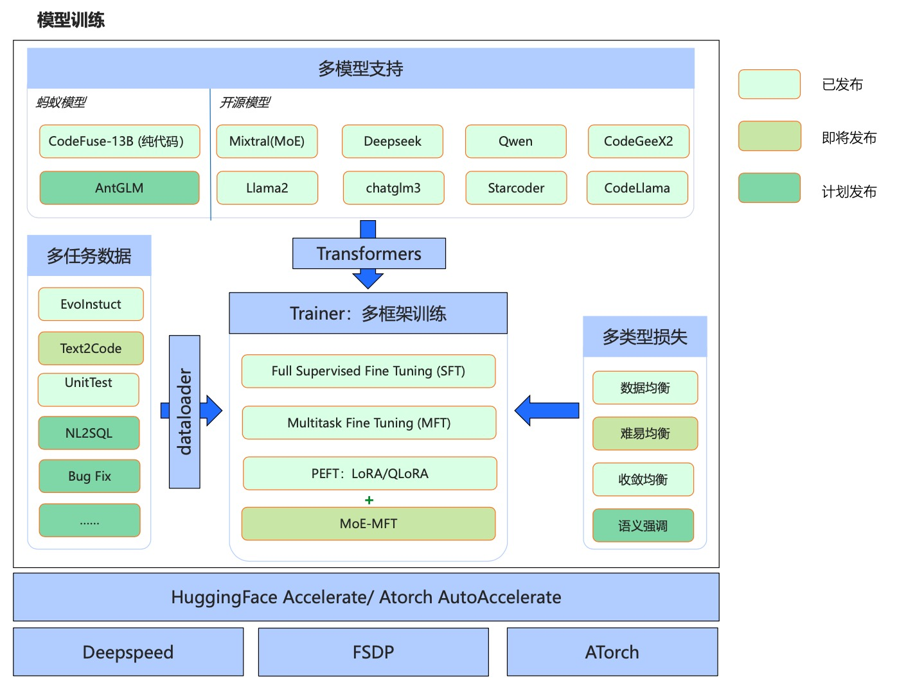

# MFTCoder: 高精度・高効率のマルチタスク大規模モデル微調整フレームワーク

<p align="center">
  
</p>


<div align="center">

<p>
    <a href="https://github.com/codefuse-ai/MFTCoder">
        
    </a>
    <a href="https://github.com/codefuse-ai/MFTCoder">
        
    </a>
    <a href="https://github.com/codefuse-ai/MFTCoder/LICENCE">
      
    </a>
    <a href="https://github.com/codefuse-ai/MFTCoder/issues">
      
    </a>
</p>

<p>
    🤗 <a href="https://huggingface.co/codefuse-ai" target="_blank">HuggingFace</a>
    • 🤖 <a href="https://modelscope.cn/organization/codefuse-ai" target="_blank">魔搭</a>
</p>

[[中文]](README_cn.md) [[English]](README.md) [**日本語**]

</div>


## 目次
- [ニュース](#ニュース)
- [記事](#記事)
- [プロジェクト概要](#プロジェクト概要)
- [環境](#環境)
- [トレーニング](#トレーニング)
- [モデル](#モデル)
- [データセット](#データセット)
- [参加方法](#参加方法)


## ニュース
🔥🔥🔥 [2024/05/20] **MFTCoder-v0.4**リリース。**QLoRA+ DeepSpeed Zero3**, **QLoRA + FSDP**トレーニングモードを追加し、より大きなモデルの微調整をサポート。Qwen2, Qwen2-MoE, Starcoder2, Gemmaなどの新しいモデルをサポート。

🔥🔥🔥 [2024/05/20] 私たちの論文 [MFTCoder: Boosting Code LLMs with Multitask Fine-Tuning](https://arxiv.org/abs/2311.02303) が KDD 2024 に採択されました。

🔥🔥🔥 [2024/05/20] [CodeFuse-StarCoder2-15B](https://huggingface.co/codefuse-ai/CodeFuse-StarCoder2-15B) モデルを公開しました。HumanEvalで73.2%のパス@1（貪欲デコーディング）を達成。

🔥🔥 [2024/01/17] **MFTCoder-v0.3.0**リリース。Mixtral(MoE), DeepSeekなどのモデルをサポート。FSDP(Fully Sharded Data Parallel)をサポート。Self-paced Lossを追加し、マルチタスクの収束バランスをサポート。詳細はWeChat公式アカウントCodeFuseの記事[MFTCoder 重磅升级v0.3.0发布](https://mp.weixin.qq.com/s/xI3f0iUKq9TIIKZ_kMtcQg)を参照。

🔥🔥 [2024/01/17] [CodeFuse-DeepSeek-33B](https://huggingface.co/codefuse-ai/CodeFuse-DeepSeek-33B) モデルを公開しました。HumanEvalで78.7%のパス@1（貪欲デコーディング）を達成。Big Codeランキングの結果は近日中に発表予定です。最新情報は公式アカウントでご確認ください。

🔥🔥 [2024/01/17] [CodeFuse-Mixtral-8x7B](https://huggingface.co/codefuse-ai/CodeFuse-Mixtral-8x7B) モデルを公開しました。HumanEvalで56.1%のパス@1（貪欲デコーディング）を達成。詳細はWeChat公式アカウントCodeFuseの記事[MFTCoder提升Mixtral-8x7B混合专家模型的代码能力实践](https://mp.weixin.qq.com/s/xI3f0iUKq9TIIKZ_kMtcQg)を参照。

🔥🔥 [2023/11/07] [MFTCoder論文](https://arxiv.org/abs/2311.02303)がArxivに公開され、マルチタスク微調整の技術的詳細が紹介されています。

🔥🔥 [2023/10/20] [CodeFuse-QWen-14B](https://huggingface.co/codefuse-ai/CodeFuse-QWen-14B) モデルを公開しました。HumanEvalで48.8%のパス@1（貪欲デコーディング）を達成。基礎モデルQwen-14bに比べて16%の向上。詳細はWeChat公式アカウントCodeFuseの記事[CodeFuse-MFTCoder提升Qwen-14B代码能力](https://mp.weixin.qq.com/s/PCQPkvbvfxSPzsqjOILCDw)を参照。

🔥🔥 [2023/09/27] [CodeFuse-StarCoder-15B](https://huggingface.co/codefuse-ai/CodeFuse-StarCoder-15B) モデルを公開しました。HumanEvalで54.9%のパス@1（貪欲デコーディング）を達成。

🔥🔥 [2023/09/26] [CodeFuse-CodeLlama-34B-4bits](https://huggingface.co/codefuse-ai/CodeFuse-CodeLlama-34B-4bits) 量子化バージョンをリリース。量子化後のモデルはHumanEvalで73.8%のパス@1（貪欲デコーディング）を達成。

🔥🔥 [2023/09/07]MFTCoder微調整のモデル**CodeFuse-CodeLlama-34B**が[HumanEval Benchmarks](https://github.com/openai/human-eval)のPython **Pass@1** で**74.4%**（貪欲デコーディング）のオープンソースSOTA成績を達成。

🔥🔥 [2023/08/26]MFTCoder-v0.1.0がリリースされ、LoRA/QLoRAを使用してCode Llama、Llama、Llama2、StarCoder、ChatGLM2、CodeGeeX2、Qwen、GPT-NeoXモデルの微調整をサポート。

### HumanEvalのパフォーマンス
| モデル                               | HumanEval(Pass@1) |   日付    |
|:---------------------------------|:-----------------:|:-------:|
| **CodeFuse-DeepSeek-33B**        |     **78.7%**     | 2024/01 |
| **CodeFuse-CodeLlama-34B**       |     **74.4%**     | 2023/09 |
| **CodeFuse-CodeLlama-34B-4bits** |     **73.8%**     | 2023/09 |
| **CodeFuse-StarCoder2-15B**      |     **73.2%**     | 2023/05 |
| WizardCoder-Python-34B-V1.0      |       73.2%       | 2023/08 |
| GPT-4(zero-shot)                 |       67.0%       | 2023/03 |
| PanGu-Coder2 15B                 |       61.6%       | 2023/08 |
| **CodeFuse-Mixtral-8x7B**        |     **56.1%**     | 2024/01 |
| **CodeFuse-StarCoder-15B**       |     **54.9%**     | 2023/08 |
| CodeLlama-34b-Python             |       53.7%       | 2023/08 |
| **CodeFuse-QWen-14B**            |     **48.8%**     | 2023/10 |
| CodeLlama-34b                    |       48.8%       | 2023/08 |
| GPT-3.5(zero-shot)               |       48.1%       | 2022/11 |
| OctoCoder                        |       46.2%       | 2023/08 |
| StarCoder-15B                    |       33.6%       | 2023/05 |
| QWen-14B                         |       32.3%       | 2023/10 |


## 記事
🔥 [CodeFuse-MFTCoder提升CodeGeeX2-6B代码能力](https://mp.weixin.qq.com/s/kWMtHIoe3ytN8pRVi_CHZg)

🔥 [CodeFuse-MFTCoder提升Qwen-14B代码能力](https://mp.weixin.qq.com/s/PCQPkvbvfxSPzsqjOILCDw)


## プロジェクト概要
**国際初の高精度・高効率・マルチタスク・マルチモデル対応・多トレーニングアルゴリズムの大規模モデルコード能力微調整フレームワーク**

**Codefuse-MFTCoder** は、コード大規模言語モデルプロジェクトのオープンソースであり、コード大規模モデルのモデル、データ、トレーニングなどを含みます。オープンソースを通じて、大規模言語モデルのコード分野での進展を共有し、交流することを目指しています。

### プロジェクトフレームワーク


### プロジェクトの利点
:white_check_mark: **マルチタスク**：1つのモデルが複数のタスクを同時にサポートし、複数のタスク間のバランスを保ち、見たことのない新しいタスクにも一般化できます。

:white_check_mark: **マルチモデル**：最新の複数のオープンソースモデルをサポートし、gpt-neox、llama、llama-2、baichuan、Qwen、chatglm2などを含みます。

:white_check_mark: **マルチフレームワーク**：主流のオープンソースAccelerate+DeepSpeed/FSDPをサポートし、新しいオープンソースの[ATorch フレームワーク](https://github.com/intelligent-machine-learning/dlrover)もサポートします。

:white_check_mark: **高効率微調整**：LoRAとQLoRAをサポートし、非常に少ないリソースで非常に大きなモデルを微調整でき、トレーニング速度はほぼすべての微調整シナリオに対応できます。

本プロジェクトの主な内容は以下の通りです：
- 単一タスクSFT（Supervised FineTuning）とMFT（Multi-task FineTuning）の両方をサポートし、現在のオープンソースはデータの均衡をサポートし、将来的には難易度の均衡、収束の均衡などを継続的にオープンソース化します。
- QLoRA低コスト高効率指令微調整、LoRA高効率指令微調整、全量パラメータ高精度微調整をサポートします。
- ほとんどの主流のオープンソース大規模モデルをサポートし、特にコード能力に優れたオープンソース大規模モデルに重点を置いています。DeepSeek-coder、Mistral、Mistral(MoE)、Chatglm3、Qwen、GPT-Neox、Starcoder、Codegeex2、Code-LLaMAなど。
- loraとベースモデルの重みの統合をサポートし、推論をより便利にします。
- 2つの指令微調整データセットを整理してオープンソース化：[Evol-instruction-66k](https://huggingface.co/datasets/codefuse-ai/Evol-instruction-66k)と[CodeExercise-Python-27k](https://huggingface.co/datasets/codefuse-ai/CodeExercise-Python-27k)。
- 複数の[Codefuseシリーズ指令微調整モデルの重み]をオープンソース化し、詳細はhuggingface組織とmodelscope組織のモデルを参照：[codefuse-ai huggingface](https://huggingface.co/codefuse-ai) または [codefuse-ai 魔搭](https://modelscope.cn/organization/codefuse-ai)。


## 環境
まず、CUDA（11.4以上、推奨12.1）および関連ドライバを正常にインストールし、正常に動作することを確認し、基本的なtorch（2.1.0以上）をインストールします。
requirements.txtにはいくつかの主要なPythonパッケージのバージョンが固定されており、以下のスクリプトを実行するだけでインストールできます：
```bash
sh init_env.sh
```
flash attention（2.3.0以上）のインストールを強くお勧めします。インストールについては https://github.com/Dao-AILab/flash-attention を参照してください。

## トレーニング
大規模モデルのトレーニングに関する主流のオープンソースリソース（例：```transformers```, ```DeepSpeed```, ```FSDP```など）に精通している場合、オープンソースプロジェクトを使用して高性能な微調整を迅速に開始するために、以下をお勧めします：

🚀🚀 [MFTCoder-accelerate: Accelerate + DeepSpeed/FSDP Codebase for MFT(Multi-task Finetuning)](mftcoder_accelerate/README.md)


新しいトレーニングフレームワークを探索したい場合は、以下を試してみてください：

🚀 [MFTCoder-atorch: Atorch Codebase for MFT(Multi-task Finetuning)](mftcoder_atorch/README.md)


## モデル

本プロジェクトのトレーニングコードと上記のトレーニングデータを使用して、以下のモデルをhuggingfaceとmodelscopeでオープンソース化しました。

| モデル                                   | HuggingFaceリンク                                                         | 魔搭リンク                                                                           | 基礎モデル                 | トレーニングデータ | バッチサイズ | シーケンス長 |
|--------------------------------------|---------------------------------------------------------------------------|---------------------------------------------------------------------------------|----------------------|------|------------|------------|
| 🔥🔥🔥  CodeFuse-DeepSeek-33B        | [h-link](https://huggingface.co/codefuse-ai/CodeFuse-DeepSeek-33B)        | [m-link](https://modelscope.cn/models/codefuse-ai/CodeFuse-DeepSeek-33B)        | DeepSeek-coder-33B   | 60万  | 80         | 4096       |
| 🔥🔥🔥  CodeFuse-Mixtral-8x7B        | [h-link](https://huggingface.co/codefuse-ai/CodeFuse-Mixtral-8x7B)        | [m-link](https://modelscope.cn/models/codefuse-ai/CodeFuse-Mixtral-8x7B)        | Mixtral-8x7B         | 60万  | 80         | 4096       |
| 🔥🔥🔥  CodeFuse-CodeLlama-34B       | [h-link](https://huggingface.co/codefuse-ai/CodeFuse-CodeLlama-34B)       | [m-link](https://modelscope.cn/models/codefuse-ai/CodeFuse-CodeLlama-34B)       | CodeLlama-34b-Python | 60万  | 80         | 4096       |
| 🔥🔥🔥  CodeFuse-CodeLlama-34B-4bits | [h-link](https://huggingface.co/codefuse-ai/CodeFuse-CodeLlama-34B-4bits) | [m-link](https://modelscope.cn/models/codefuse-ai/CodeFuse-CodeLlama-34B-4bits) | CodeLlama-34b-Python |      |          | 4096       |
| 🔥🔥🔥  CodeFuse-StarCoder-15B       | [h-link](https://huggingface.co/codefuse-ai/CodeFuse-StarCoder-15B)       | [m-link](https://modelscope.cn/models/codefuse-ai/CodeFuse-StarCoder-15B)       | StarCoder-15B        | 60万  | 80         | 4096       |
| 🔥🔥🔥  CodeFuse-QWen-14B            | [h-link](https://huggingface.co/codefuse-ai/CodeFuse-QWen-14B)            | [m-link](https://modelscope.cn/models/codefuse-ai/CodeFuse-QWen-14B)            | Qwen-14b             | 110万 | 256         | 4096       | 
| 🔥🔥🔥  CodeFuse-CodeGeex2-6B        | [h-link](https://huggingface.co/codefuse-ai/CodeFuse-CodeGeex2-6B)        | [m-link](https://modelscope.cn/models/codefuse-ai/CodeFuse-CodeGeex2-6B)        | CodeGeex2-6B         | 110万 | 256         | 4096       | 
| 🔥🔥🔥  CodeFuse-StarCoder2-15B      | [h-link](https://huggingface.co/codefuse-ai/CodeFuse-StarCoder2-15B)        | [m-link](https://modelscope.cn/models/codefuse-ai/CodeFuse-StarCoder2-15B)        | Starcoder2-15B       | 70万  | 128        | 4096       |


## データセット
現在、本プロジェクトでは以下の指令データセットを整理し、統一されたデータ形式に変換しました。これらの指令微調整データセットは、私たちのマルチタスクトレーニングの数十のタスクのうちの2つです。今後、さらに多くのコードタスク指令微調整データセットを順次オープンソース化する予定です。

| データセット                                                           | 説明                                                                 |
|---------------------------------------------------------------|--------------------------------------------------------------------|
| [⭐ Evol-instruction-66k](https://huggingface.co/datasets/codefuse-ai/Evol-instruction-66k)    | オープンソースのopen-evol-instruction-80kを基に、低品質、重複、およびHumanEvalに類似したデータをフィルタリングして得られた高品質なコード指令データセット |
| [⭐ CodeExercise-Python-27k](https://huggingface.co/datasets/codefuse-ai/CodeExercise-Python-27k) | 高品質なPython練習問題データセット                                         |

## 引用
私たちの仕事があなたに役立つと思われる場合は、以下のように私たちの論文を引用してください。
```
@article{mftcoder2023,
      title={MFTCoder: Boosting Code LLMs with Multitask Fine-Tuning}, 
      author={Bingchang Liu and Chaoyu Chen and Cong Liao and Zi Gong and Huan Wang and Zhichao Lei and Ming Liang and Dajun Chen and Min Shen and Hailian Zhou and Hang Yu and Jianguo Li},
      year={2023},
      journal={arXiv preprint arXiv},
      archivePrefix={arXiv},
      eprint={2311.02303}
}
```

## 参加方法

私たちは、Ant Groupのプラットフォーム技術事業グループ内のAI Nativeチームであり、Ant Groupのプラットフォームエンジニアリングのインテリジェント化を担当しています。設立から3年以上が経ち、Ant Groupのクラウドコンピューティングインフラストラクチャのインテリジェント運用と保守のアップグレードにおいて重要な役割を果たしてきました。私たちのミッションは、世界クラスの技術革新と影響力を通じて、広範なユーザーベースを持つアルゴリズムサービスとプラットフォームを構築し、内部および外部の製品とビジネスの実装を支援することです。
革新主導の精神を受け入れ、ビジネスの実装を支援するだけでなく、技術的な影響力も推進しています。過去3年間で、ICLR、NeurIPS、KDD、ACLなどのトップ会議で20以上の論文を発表しました。私たちの革新的なビジネス成果は、Ant Technologyの最高のT-Star賞を2回、Ant GroupのSuperMA賞を1回受賞しました。私たちのオープンソースプロジェクトCodeFuseは、2024年2月時点で4Kのスターを獲得し、HuggingfaceとModelscopeでのモデルの累計ダウンロード数は150万回を超えています。

**私たちは、活気に満ちたチームに参加するトップタレントを探しています！エネルギー、革新、卓越した文化に満ちた環境でキャリアを発展させたいと考えている場合は、キャンパスおよび経験豊富な採用のキャリア機会を確認し、次の業界のマイルストーンを一緒に作り上げるために参加してください。**

**キャンパス採用**：https://hrrecommend.antgroup.com/guide.html?code=8uoP5mlus5DqQYbE_EnqcE2FD5JZH21MwvMUIb9mb6X3osXPuBraG54SyM8GLn_7

**経験豊富な採用**：https://talent.antgroup.com/off-campus-position?positionId=1933830
